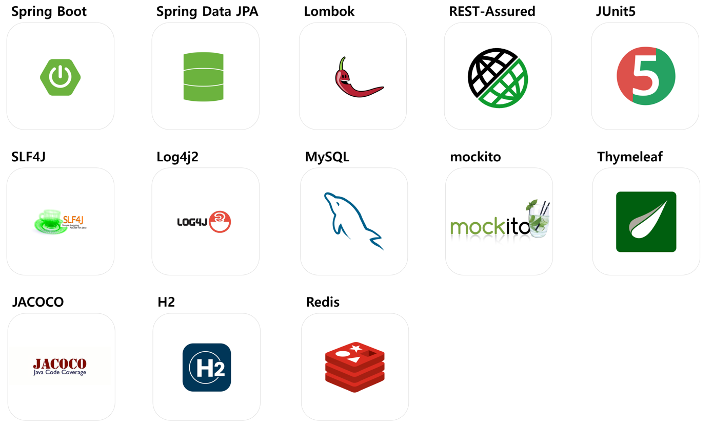
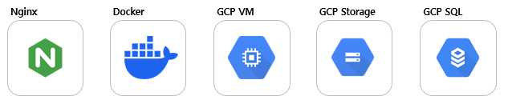
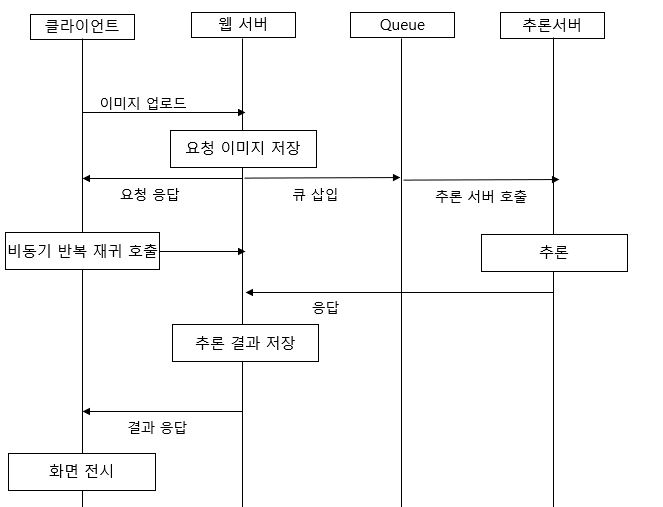
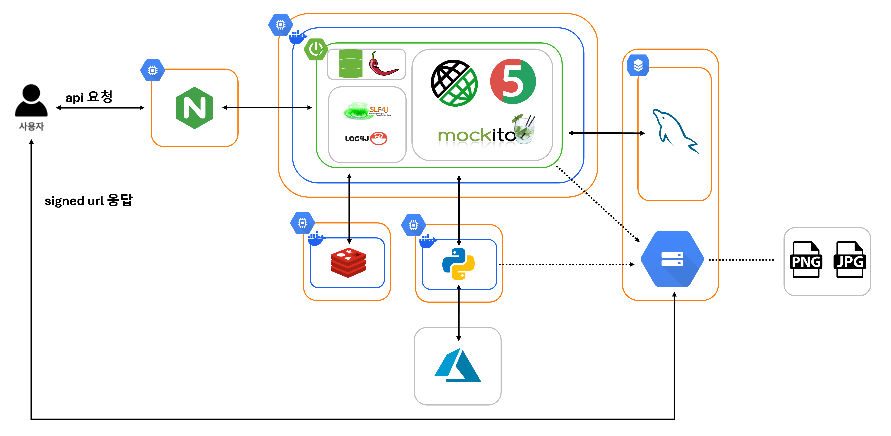
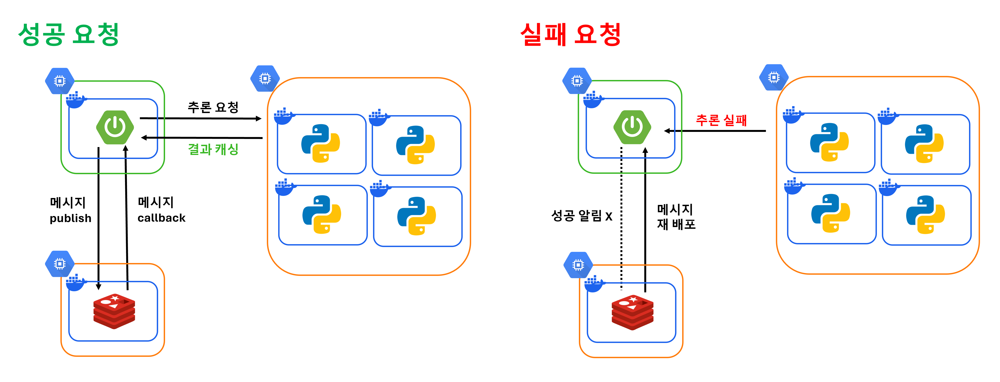
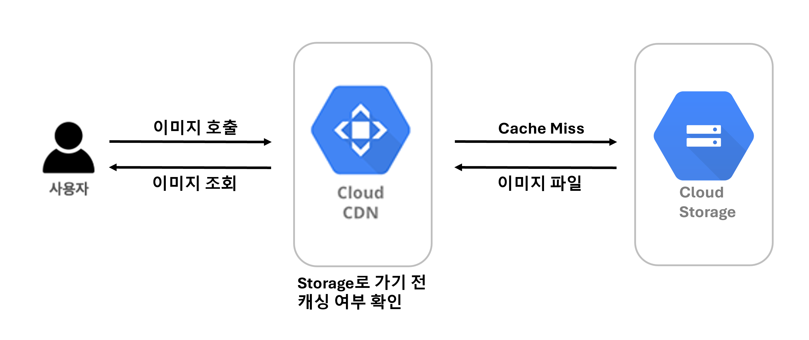

# 👗 Shopping Helper - 스케치 기반 원하는 의류 검색 도우미

## Introduction
"Shopping Helper"는 원하는 의류에 대한 검색 키워드가 생각나지 않거나 키워드 기반 검색 품질이 좋지 않을 때 사용할 수 있는 서비스이다. 직접 그린 의류 스케치를 실사화하고 변환된 이미지로 실제 쇼핑몰에서 판매하고 있는 유사 상품을 검색하여, 사용자의 니즈를 완벽히 반영한 검색 경험을 제공한다.

## 🗂️ Index

- [🌈 데모](#-demo)<br>
- [🛠 사용 기술](#-skills)<br>
- [🏛️ 전체 서비스 아키텍처](#-project-structure)<br>
- [💡 실행 방식](#-get-started)<br>

## 🌈 Demo

| 검색 가이드 |
| --- |
||
| 실사화 성능이 높은 최적의 채색 방식 가이드 제공 |
||
| 4가지 의류 카테고리 기본 밑그림 제공 |

| 검색 프로세스 1 - 수정|
| --- |
||
||
| 개인 장비에서 의류 스케치 수정 |

| 검색 프로세스 2 - 채색|
| --- |
||
| 개인 장비에서 색깔펜으로 포인팅 |

| 검색 프로세스 3 - 업로드|
| --- |
||
| 검색하고 싶은 디자인 스케치 업로드 |

| 검색 프로세스 4 - 검색 결과 조회 |
| --- |
||
| 6개의 쇼핑몰과 Bing 검색 엔진 검색 결과 조회 |

| 검색 및 채색 갤러리 |
| --- |
||
| 자신의 채색 및 검색 결과를 갤러리에 공유하기 |
||
| 타 유저 검색 결과 보기 |

## 🛠 Skills

## 백엔드


## 인프라


## 추론 서버 & 검색 API


## 🏛️ Project Structure

## 1. 추론 요청 파이프라인


## 2. 서비스 요청 흐름도


## 3. 분산 환경 메시지 큐 설계도


## 4. 이미지 요청 흐름도



## 💡 Get Started

### 1. Prerequisites
#### Docker Environment

```
>>> docker -v: 24.0.7
>>> docker-compose -v: v2.23.3-desktop.2
```

### 2. Component
#### 2.1 Spring
- 추론 요청을 받는 API 서버, DBMS에 적재된 추론 결과를 클라이언트로 반환하는 역할

#### 2.2 Redis
- 추론 요청을 관리하는 Queue
- CLOTHES 추론 요청 Queue 1개로 의류 4개 카테고리(상의, 하의, 모자, 치마) 요청을 처리
- Data Type: Stream

#### 2.3 Mysql (Cloud)
- 업로드, 추론 결과 정보를 저장하는 Store

#### 2.4 Python HTTPServer
- 파이썬 스크립트를 HTTP 서버로 띄우기 위한 라이브러리

# How to use it
## Spring Test

```
>>> cd shopping-helper\backend
>>> ./gradlew test

>>> open .\build\reports\tests\test\index.html (mac)
>>> start .\build\reports\tests\test\index.html (window)
```

## Application Run

### Use Docker
```
>>> sudo lsof -i :3306
>>> sudo kill PID (Docker Mysql 포트 할당을 위함)

>>> cd shopping-helper
>>> docker-compose up --build
```

### Use Local IDE

#### (Spring 서버 실행 1-1) 프로필 환경변수 설정(application.yml)
- ```SOURCE_MYSQL_URL``` = Mysql IP
- ```SOURCE_MYSQL_USERNAME``` = Mysql user name
- ```SOURCE_MYSQL_PASSWORD``` = Mysql 패스워드
- ```SOURCE_REDIS_URL``` = Redis IP
- ```SOURCE_REDIS_PORT``` = 6379
- ```GCS_BUCKET``` = 스토리지 버킷명
- ```GCS_CREDENTIALS``` = 프로젝트 권한키
- ```GCS_PROJECT_ID``` = 프로젝트 ID

#### (Spring 서버 실행 1-2) IntelliJ 서버 ON

 
#### (Spring 서버 실행 2) JAR BUILD & 파일 실행
```
>>> cd backend
>>> java -jar backend-0.0.1-SNAPSHOT.jar \
     -DSOURCE_MYSQL_URL="jdbc:mysql://localhost:3306/SKETCH2FASHIONautoReconnect=true&serverTimezone=Asia/Seoul" \
     -DSOURCE_MYSQL_USERNAME="root" \
     -DSOURCE_MYSQL_PASSWORD="password" \
     -DSOURCE_REDIS_URL="127.0.0.1" \
     -DSOURCE_REDIS_PORT="6379" \
     -DGCS_BUCKET="bucket" \
     -DGCS_CREDENTIALS="key" \
     -DGCS_PROJECT_ID="id" \
```

#### (추론 서버 실행 1-1) TSHIRTS, PANTS, HAT, SKIRT 서버 ON
```
>>> cd ml
>>> pip install -r requirements.txt

>>> python tshirts_worker.py
>>> python pants_worker.py
>>> python hat_worker.py
>>> python skirt_worker.py
```
